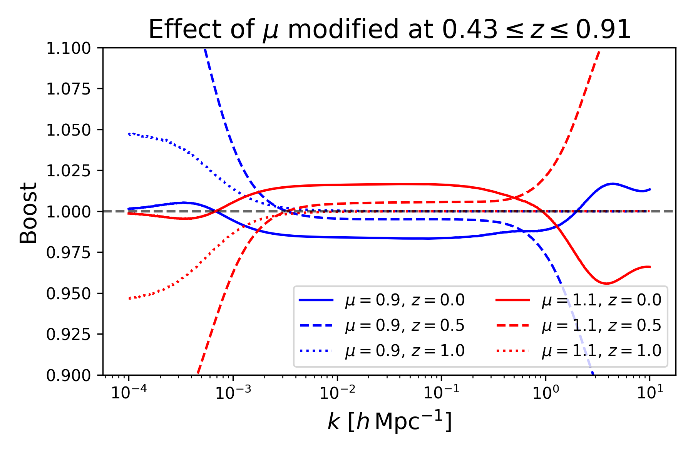

# MG Boost Emulator

A fast emulator for the modified gravity boost to the matter power spectrum,
covering linear to nonlinear scales via a hybrid NN + GP approach.

This emulator involves:	
- A neural network (NN) for linear scales
- A Gaussian Process (GP) emulator for nonlinear scales
- A smooth stitching procedure across k

It supports redshift-dependent modified gravity models with binning. 

---

##  Features

- Accurate to ~1% across parameter space
- Supports multiple redshifts
- Handles MG parameters (μ, η) and bin-dependent activation
- Fully replaces expensive Boltzmann / simulation calls in inference pipelines

---

## Example Output


Modified gravity boost as a function of scale for different values of $\mu$ and redshift for one of the MG bins.

```python
import numpy as np
import matplotlib.pyplot as plt
from emulator import MGEmulator

mus = [0.9, 1.0, 1.1]

plt.figure(figsize=(6,4))

for m in mus:
    k, boost = emu.predict_boost(
        cosmo,
        mu=m,
        eta=1.0,
        bin_index=1,
        zs=[0., 0.5, 1.0]
    )
    plt.semilogx(k, boost[0], label=f"mu = {m}, z=0")

plt.axhline(1.0, linestyle="--", color="black")

plt.xlabel("k")
plt.ylabel("Boost")
plt.legend()
plt.title("Effect of μ")
plt.show()

```



---

## Training Parameter Ranges

Despite the fact that the emulator is sub-percent accurate to high-k, we emphasize that the accuracy of the emulator beyond k= 1 h/Mpc is significantly affected by the limitations of the COLA simulations that Gaussian Process emulator is trained on. So we do not recommend employing the emulator in analyses incolving cosmological inference on scales smaller than 1h/Mpc. Below are the flat prior ranges for the parameters used to train the linear and the non-linear emulators. Currently, the code gives you a warning if you pass a value that is outside this prior range. We do not guarantee the accuracy/precision in P(k) outside of these prior ranges. 

| Parameter | Min | Max |
|----------|-----|-----|
| Ωm       | 0.25 | 0.35 |
| Ωb       | 0.04 | 0.055 |
| h        | 0.65 | 0.73 |
| ns       | 0.95 | 1.0 |
| ln(10¹⁰ As) | 2.996 | 3.091 |
| μ        | 0.9 | 1.1 |
| η        | 0.9 | 1.1 |
| z        | 0.01 | 3.0 |
| bin_index | 0 | 4 |

---

## Repository Structure
```
mg_boost_emulator/
│
├── emulator/ # Core emulator code
├── src/ # Required for loading pickled Standardizer (bin 5 GP)
├── models/ # Pretrained models (not included)
├── examples/ # Demo script
│
├── README.md
├── requirements.txt

```
---

## Model Files

Pretrained models are **not included** in this repository due to size.

---


Pretrained models are available at:
```
[Zenodo Dataset](https://zenodo.org/records/19625918)
```
After downloading, place all files in:

```bash
models/
```
The emulator will not run without these files.
---

Required files:
```
linear_boost_nn.pt
gp_full_corrected.cpk
gp_bin5.cpk
pca_full_corrected.cpk
pca_bin5.cpk
standardizer_bin5.cpk
cola_eg.txt
```
---

## Installation

Clone the repo:

```python
git clone https://github.com/yourusername/mg_boost_emulator.git
cd mg_boost_emulator
```
Install dependencies:
```python
pip install -r requirements.txt
```
---

### Running the Demo

From the repo root:
```python
python -m examples.demo
```
This will:

- Load the NN + GP emulators  
- Compute the MG boost  
- Plot the result  

Alternatively, run the example Jupyter notebook, which does the same and allows you to play around with the emulator inputs. 

## References

### Main paper that shows how this emulator was developed and some results using it.

- [MG Boost Emulator Paper (arXiv:2603.11895)](https://arxiv.org/pdf/2603.11895)  
  Sankarshana Srinivasan, Shreya Prabhu, Kai Lehman, Ajiv Krishnan Vinaychandran, and Jochen Weller (2026)

  *Cosmological gravity on all scales V: MCMC forecasts combining large scale structure and CMB lensing for binned phenomenological modified gravity*

  Uses emulator to compute matter power spectrum and therefore build the 3x2pt data vector for LSST Y10, and also construct the combination of CMB lensing with the 3x2pt data vector. The emulator allows one to test for deviations across a variety of bins (one at a time) between z = 0 and z = 3.

---

### Supporting work

- Srinivasan, S., Thomas, D. B., & Taylor, P. L. (2025)  
  *Cosmological gravity on all scales. Part IV. 3×2pt Fisher forecasts for pixelised phenomenological modified gravity*  
  [arXiv:2409.06569](https://arxiv.org/abs/2409.06569) 
  
  This paper used a similar binned MG model, but used the ReACT code for predictions.  

- Srinivasan, S., Thomas, D. B., & Battye, R. (2024)  
  *Cosmological gravity on all scales. Part III. Non-linear matter power spectrum in phenomenological modified gravity*  
  [arXiv:2306.17240](https://arxiv.org/abs/2306.17240)
  
  Validation of ReACT code on N-body simulations for binned MG

- Srinivasan, S., Thomas, D. B., Pace, F., & Battye, R. (2021)  
  *Cosmological gravity on all scales. Part II. Model independent modified gravity N-body simulations*  
  [arXiv:2103.05051](https://arxiv.org/abs/2103.05051)
  
  First paper that ran N-body simulations for this type of binned MG

- Thomas, D. B. (2020)  
  *Cosmological gravity on all scales: Simple equations, required conditions, and a framework for modified gravity*  
  [arXiv:2004.13051](https://arxiv.org/abs/2004.13051)
  
  Theory paper, introduces binned MG parameterisation and assumptions. 
